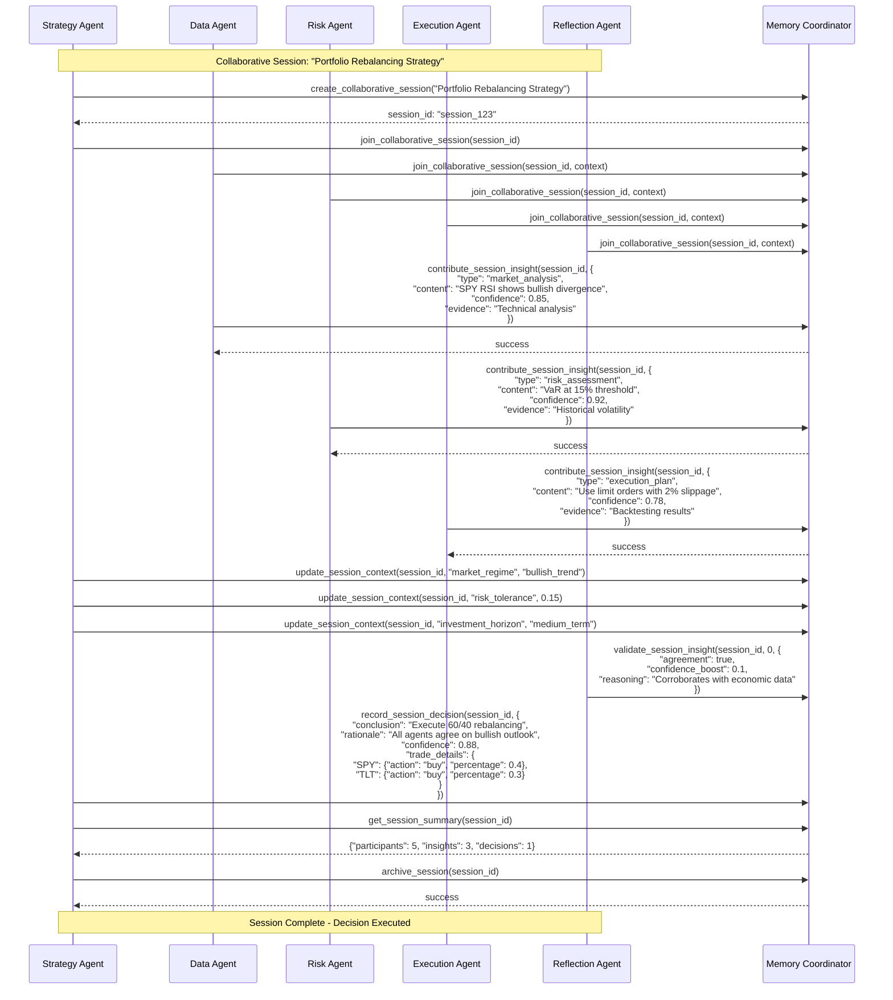
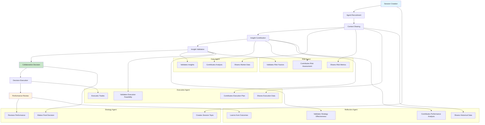
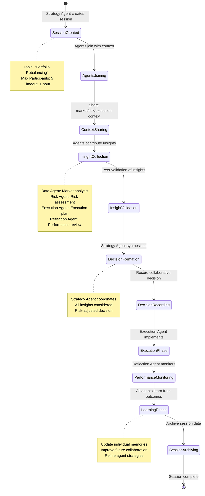

```mermaid
sequenceDiagram
    participant SA as Strategy Agent
    participant DA as Data Agent
    participant RA as Risk Agent
    participant EA as Execution Agent
    participant RefA as Reflection Agent
    participant Coord as Memory Coordinator

    Note over SA,RefA: Collaborative Session: "Portfolio Rebalancing Strategy"

    %% Session Creation
    SA->>Coord: create_collaborative_session("Portfolio Rebalancing Strategy")
    Coord-->>SA: session_id: "session_123"

    %% Agent Joining
    SA->>Coord: join_collaborative_session(session_id)
    DA->>Coord: join_collaborative_session(session_id, context)
    RA->>Coord: join_collaborative_session(session_id, context)
    EA->>Coord: join_collaborative_session(session_id, context)
    RefA->>Coord: join_collaborative_session(session_id, context)

    %% Data Agent Contribution
    DA->>Coord: contribute_session_insight(session_id, {<br/>  "type": "market_analysis",<br/>  "content": "SPY RSI shows bullish divergence",<br/>  "confidence": 0.85,<br/>  "evidence": "Technical analysis"<br/>})
    Coord-->>DA: success

    %% Risk Agent Contribution
    RA->>Coord: contribute_session_insight(session_id, {<br/>  "type": "risk_assessment",<br/>  "content": "VaR at 15% threshold",<br/>  "confidence": 0.92,<br/>  "evidence": "Historical volatility"<br/>})
    Coord-->>RA: success

    %% Execution Agent Contribution
    EA->>Coord: contribute_session_insight(session_id, {<br/>  "type": "execution_plan",<br/>  "content": "Use limit orders with 2% slippage",<br/>  "confidence": 0.78,<br/>  "evidence": "Backtesting results"<br/>})
    Coord-->>EA: success

    %% Context Updates
    SA->>Coord: update_session_context(session_id, "market_regime", "bullish_trend")
    SA->>Coord: update_session_context(session_id, "risk_tolerance", 0.15)
    SA->>Coord: update_session_context(session_id, "investment_horizon", "medium_term")

    %% Insight Validation
    RefA->>Coord: validate_session_insight(session_id, 0, {<br/>  "agreement": true,<br/>  "confidence_boost": 0.1,<br/>  "reasoning": "Corroborates with economic data"<br/>})

    %% Collaborative Decision
    SA->>Coord: record_session_decision(session_id, {<br/>  "conclusion": "Execute 60/40 rebalancing",<br/>  "rationale": "All agents agree on bullish outlook",<br/>  "confidence": 0.88,<br/>  "trade_details": {<br/>    "SPY": {"action": "buy", "percentage": 0.4},<br/>    "TLT": {"action": "buy", "percentage": 0.3}<br/>  }<br/>})

    %% Session Monitoring
    SA->>Coord: get_session_summary(session_id)
    Coord-->>SA: {"participants": 5, "insights": 3, "decisions": 1}

    %% Session Archiving
    SA->>Coord: archive_session(session_id)
    Coord-->>SA: success

    Note over SA,RefA: Session Complete - Decision Executed
```

```mermaid
flowchart TD
    A[Session Creation] --> B[Agent Recruitment]
    B --> C[Context Sharing]
    C --> D[Insight Contribution]
    D --> E[Insight Validation]
    E --> F[Collaborative Decision]
    F --> G[Decision Execution]
    G --> H[Performance Review]

    subgraph "Strategy Agent"
        A1[Creates Session Topic]
        F1[Makes Final Decision]
        H1[Reviews Performance]
    end

    subgraph "Data Agent"
        C1[Shares Market Data]
        D1[Contributes Analysis]
        E1[Validates Insights]
    end

    subgraph "Risk Agent"
        C2[Shares Risk Metrics]
        D2[Contributes Risk Assessment]
        E2[Validates Risk Factors]
    end

    subgraph "Execution Agent"
        C3[Shares Execution Data]
        D3[Contributes Execution Plan]
        E3[Validates Execution Feasibility]
        G1[Executes Trades]
    end

    subgraph "Reflection Agent"
        C4[Shares Historical Data]
        D4[Contributes Performance Analysis]
        E4[Validates Strategy Effectiveness]
        H2[Learns from Outcomes]
    end

    A --> A1
    C --> C1
    C --> C2
    C --> C3
    C --> C4
    D --> D1
    D --> D2
    D --> D3
    D --> D4
    E --> E1
    E --> E2
    E --> E3
    E --> E4
    F --> F1
    G --> G1
    H --> H1
    H --> H2

    style A fill:#e1f5fe
    style F fill:#c8e6c9
    style H fill:#fff3e0
```

```mermaid
stateDiagram-v2
    [*] --> SessionCreated: Strategy Agent creates session

    SessionCreated --> AgentsJoining: Agents join with context
    AgentsJoining --> ContextSharing: Share market/risk/execution context

    ContextSharing --> InsightCollection: Agents contribute insights
    InsightCollection --> InsightValidation: Peer validation of insights

    InsightValidation --> DecisionFormation: Strategy Agent synthesizes
    DecisionFormation --> DecisionRecording: Record collaborative decision

    DecisionRecording --> ExecutionPhase: Execution Agent implements
    ExecutionPhase --> PerformanceMonitoring: Reflection Agent monitors

    PerformanceMonitoring --> LearningPhase: All agents learn from outcomes
    LearningPhase --> SessionArchiving: Archive session data

    SessionArchiving --> [*]: Session complete

    note right of SessionCreated
        Topic: "Portfolio Rebalancing"
        Max Participants: 5
        Timeout: 1 hour
    end note

    note right of InsightCollection
        Data Agent: Market analysis
        Risk Agent: Risk assessment
        Execution Agent: Execution plan
        Reflection Agent: Performance review
    end note

    note right of DecisionFormation
        Strategy Agent coordinates
        All insights considered
        Risk-adjusted decision
    end note

    note right of LearningPhase
        Update individual memories
        Improve future collaboration
        Refine agent strategies
    end note
```