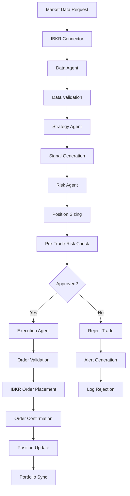
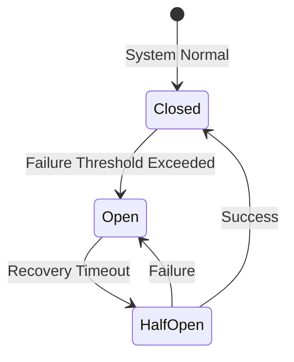
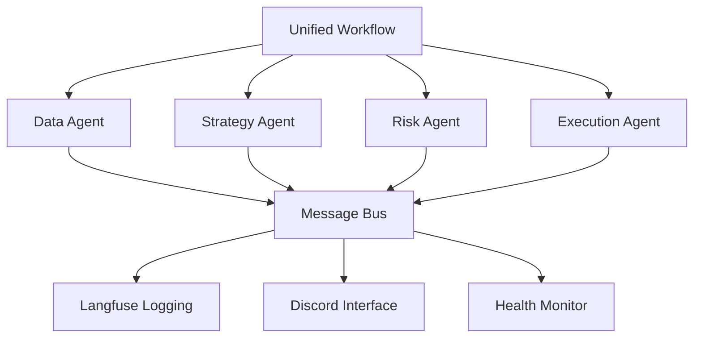
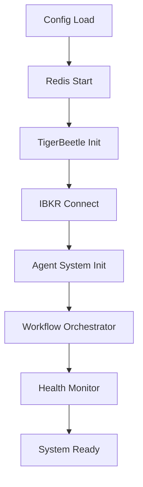
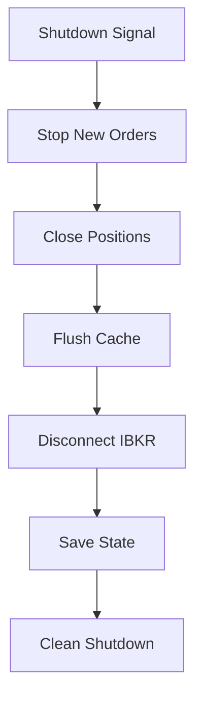

# Component Interaction Diagrams

## System Architecture Overview

```
┌─────────────────────────────────────────────────────────────────┐
│                    ABC-Application Trading System               │
├─────────────────────────────────────────────────────────────────┤
│  ┌─────────────┐    ┌─────────────┐    ┌─────────────┐         │
│  │   Discord   │    │   Langfuse  │    │   Health    │         │
│  │  Interface  │    │   Logging   │    │  Monitoring │         │
│  └─────────────┘    └─────────────┘    └─────────────┘         │
├─────────────────────────────────────────────────────────────────┤
│  ┌─────────────┐    ┌─────────────┐    ┌─────────────┐         │
│  │   Unified   │◄──►│   Agent     │◄──►│   Memory    │         │
│  │ Workflow    │    │  System     │    │ Management  │         │
│  │ Orchestrator│    │             │    │             │         │
│  └─────────────┘    └─────────────┘    └─────────────┘         │
├─────────────────────────────────────────────────────────────────┤
│  ┌─────────────┐    ┌─────────────┐    ┌─────────────┐         │
│  │    Data     │    │  Strategy   │    │    Risk     │         │
│  │ Collection  │───►│ Evaluation │───►│ Management  │         │
│  └─────────────┘    └─────────────┘    └─────────────┘         │
├─────────────────────────────────────────────────────────────────┤
│                           ┌─────────────┐                      │
│                           │  Execution  │                      │
│                           │   Engine    │                      │
│                           └─────────────┘                      │
├─────────────────────────────────────────────────────────────────┤
│  ┌─────────────┐    ┌─────────────┐    ┌─────────────┐         │
│  │    IBKR     │    │   Redis     │    │ TigerBeetle │         │
│  │ Connector   │    │    Cache    │    │   Ledger    │         │
│  └─────────────┘    └─────────────┘    └─────────────┘         │
└─────────────────────────────────────────────────────────────────┘
```

## Critical Trading Path Flow

### Data → Strategy → Risk → Execution Workflow



## Component Interaction Details

### 1. Data Flow Architecture

```
External Data Sources
        │
        ▼
┌─────────────────┐
│  Data Agent     │
│  - Market Data  │
│  - News Feeds   │
│  - Economic Data│
└─────────────────┘
        │
        ▼
┌─────────────────┐     ┌─────────────────┐
│  Redis Cache    │◄───►│  Memory Agent  │
│  - Fast Access  │     │  - Context     │
│  - Time-series  │     │  - Patterns    │
└─────────────────┘     └─────────────────┘
        │
        ▼
┌─────────────────┐
│ Strategy Agent  │
│ - Signal Gen    │
│ - Pattern Rec   │
└─────────────────┘
```

### 2. Risk Management Flow

```
┌─────────────────┐
│  Strategy       │
│  Signal         │
└─────────────────┘
        │
        ▼
┌─────────────────┐     ┌─────────────────┐
│  Risk Agent     │────►│ Live Trading    │
│  - Position Size│     │ Safeguards      │
│  - VaR Calc     │     │ - Circuit Breaker│
│  - Stress Test  │     │ - Rate Limiting │
└─────────────────┘     └─────────────────┘
        │
        ▼
┌─────────────────┐
│  Pre-Trade      │
│  Approval       │
└─────────────────┘
```

### 3. Execution Flow

```
┌─────────────────┐
│  Approved       │
│  Trade Signal   │
└─────────────────┘
        │
        ▼
┌─────────────────┐     ┌─────────────────┐
│ Execution Agent │────►│ IBKR Connector  │
│ - Order Routing │     │ - API Calls     │
│ - Fill Tracking │     │ - Error Handling│
└─────────────────┘     └─────────────────┘
        │
        ▼
┌─────────────────┐     ┌─────────────────┐
│ TigerBeetle     │     │  Portfolio      │
│ Ledger          │     │  Update         │
│ - Transaction   │     │                 │
│ - Balance       │     │                 │
└─────────────────┘     └─────────────────┘
```

## Error Handling and Recovery

### Circuit Breaker Pattern



### Error Propagation Flow

```
┌─────────────────┐
│ Component       │
│ Failure         │
└─────────────────┘
        │
        ▼
┌─────────────────┐     ┌─────────────────┐
│ Error Handler   │────►│ Alert Manager   │
│ - Log Error     │     │ - Discord Alert │
│ - Categorize    │     │ - Email Alert   │
└─────────────────┘     └─────────────────┘
        │
        ▼
┌─────────────────┐     ┌─────────────────┐
│ Recovery Logic  │────►│ Circuit Breaker │
│ - Retry         │     │ - Backoff       │
│ - Fallback      │     │ - Isolation     │
└─────────────────┘     └─────────────────┘
```

## Data Storage Architecture

### Multi-Layer Caching Strategy

```
┌─────────────────┐
│   Application   │
│    Memory       │
├─────────────────┤
│   Redis Cache   │
│ - Session Data  │
│ - Market Data   │
├─────────────────┤
│   File System   │
│ - Config Files  │
│ - Logs          │
├─────────────────┤
│ TigerBeetle DB  │
│ - Transactions  │
│ - Balances      │
└─────────────────┘
```

## Agent Communication Patterns

### Unified Workflow Orchestrator



## Troubleshooting Decision Tree

### Connection Issues

```
IBKR Connection Failed?
        │
        ▼
    Check TWS Running?
        │
        ├─ No ──► Start TWS/Gateway
        │
        ▼
    Check Network?
        │
        ├─ No ──► Fix Network Issues
        │
        ▼
    Check Credentials?
        │
        ├─ No ──► Update API Settings
        │
        ▼
    Check Firewall?
        │
        └─ Yes ──► Contact IBKR Support
```

### Order Execution Issues

```
Order Rejected?
        │
        ▼
    Check Account Status?
        │
        ├─ Insufficient Funds ──► Add Funds
        │
        ▼
    Check Market Hours?
        │
        ├─ After Hours ──► Schedule for Next Day
        │
        ▼
    Check Order Parameters?
        │
        ├─ Invalid Symbol ──► Correct Symbol
        │
        ├─ Invalid Quantity ──► Adjust Quantity
        │
        └─ Valid ──► Contact IBKR Support
```

### Performance Issues

```
Slow Response Times?
        │
        ▼
    Check Network Latency?
        │
        ├─ High ──► Optimize Connection
        │
        ▼
    Check Memory Usage?
        │
        ├─ High ──► Clear Cache/Restart
        │
        ▼
    Check API Rate Limits?
        │
        └─ Exceeded ──► Implement Throttling
```

## Monitoring Dashboard Layout

### Key Metrics Display

```
┌─────────────────────────────────────────────────────────────────┐
│                        System Health Dashboard                  │
├─────────────────────────────────────────────────────────────────┤
│ IBKR Connection: 🟢 Connected    │ Memory Usage: 45%            │
│ Last Trade: 2025-12-04 10:30:00 │ CPU Usage: 23%                │
│ Account Balance: $75,000        │ Active Positions: 3           │
├─────────────────────────────────────────────────────────────────┤
│ Recent Alerts:                                                  │
│ • Circuit breaker activated (2 min ago)                        │
│ • Large position warning (15 min ago)                          │
├─────────────────────────────────────────────────────────────────┤
│ Active Orders:                                                  │
│ • BUY AAPL 100 @ MKT (Pending)                                 │
│ • SELL GOOGL 50 @ LMT $135 (Filled)                            │
└─────────────────────────────────────────────────────────────────┘
```

## Component Dependencies

### Startup Sequence



### Shutdown Sequence



## Performance Benchmarks

### Expected Response Times

| Operation | Target | Acceptable | Critical |
|-----------|--------|------------|----------|
| Market Data | <100ms | <500ms | >1s |
| Order Placement | <200ms | <1s | >2s |
| Account Query | <50ms | <200ms | >500ms |
| Risk Check | <10ms | <50ms | >100ms |

### Throughput Targets

- Market Data Updates: 1000/sec
- Order Processing: 100/min
- Account Queries: 500/sec
- Risk Calculations: 1000/sec

## Alert Escalation Matrix

### Alert Levels

```
┌─────────────┬─────────────────┬─────────────────┬─────────────┐
│ Level       │ Description     │ Response Time   │ Escalation  │
├─────────────┼─────────────────┼─────────────────┼─────────────┤
│ INFO        │ Normal Events   │ Log Only        │ None        │
│ WARNING     │ Potential Issue │ <5 min         │ Email        │
│ ERROR       │ System Error    │ <1 min         │ SMS + Email  │
│ CRITICAL    │ System Down     │ Immediate       │ Phone Call  │
└─────────────┴─────────────────┴─────────────────┴─────────────┘
```

This documentation provides a comprehensive view of how system components interact, making troubleshooting and maintenance more efficient.